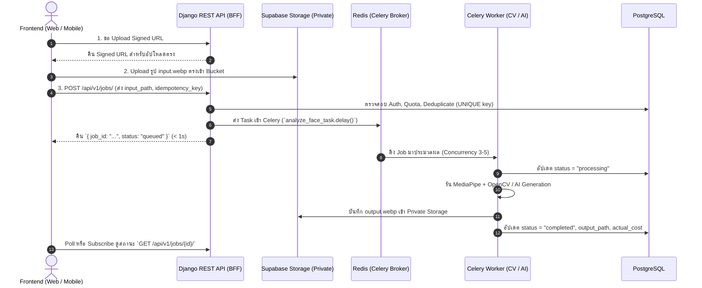

# DOODEE — AI Agent Build Spec & Engineering Architecture

> **Purpose for AI Agents:** เอกสารนี้คือ **Master System Prompt & Engineering Specification** สำหรับ AI Coding Agent (Cursor, Claude Code, Windsurf, Copilot, Antigravity ฯลฯ) เพื่อใช้เป็นแนวทางและกฎเหล็กในการสร้าง, ปรับปรุง หรือ refactor โค้ดในโปรเจกต์ **DooDee** ให้ตรงตามเป้าหมายสถาปัตยกรรม (2,000+ users, Scaling, Cost Control, Privacy & Reliability)

---

## 🎯 1. Project Overview & Core Goals

**DooDee** คือแพลตฟอร์มวิเคราะห์ใบหน้าและพรีวิวหัตถการความงาม (Face Analysis, Treatment Preview & Beauty Chatbot Assistant)

### Core Engineering Goals
1. **ไม่พังง่าย (High Reliability & Backpressure):** เมื่อเกิด Traffic Spike ระบบต้องไม่ล่ม แต่จัดการด้วยคิว (Queue)
2. **ไม่แล็กเพราะ AI (Non-blocking Web Request):** แยกงาน Heavy Computation / Image AI ออกจาก Request Path
3. **คุมค่าใช้จ่าย AI ได้ (Cost & Quota Governance):** ป้องกัน Duplicate API Cost ด้วย Idempotency Key และ Tracking ทุก Token/Cost
4. **ความปลอดภัยของข้อมูลใบหน้า (Biometric Privacy):** รูปใบหน้าต้องเป็น Private Object Storage และการวิเคราะห์ภาพ (CV) ต้องรันภายในเครื่องของเราเท่านั้น ไม่ส่งออกภายนอก

---

## 🛠️ 2. Tech Stack & Repository Structure

โปรเจกต์เป็นแบบ **Monorepo (npm workspaces)**:

```text
├── apps/
│   ├── web/          # Vite + React 19 + TypeScript (@tanstack/react-query, react-router-dom v7) -> Port 5173
│   └── mobile/       # Expo 57 + React Native 0.86 (expo-router, react-native-vision-camera)
├── backend/          # Django 5.2 + Django REST Framework (Python 3.11-slim) -> Port 8001 (host) / 8000 (container)
│   ├── doodee/       # Core app (models, views, tasks, chat, storage, authentication)
│   └── config/       # Django settings & wsgi/celery setup
├── packages/
│   └── shared/       # Shared TypeScript types & utility functions
├── compose.yaml      # Docker Compose: postgres (16), redis (7), api (Django), worker (Celery), beat (Scheduler)
└── techstack.md      # Tech stack reference
```

### Component Details
* **Backend Framework:** Django `~=5.2.0` + Django REST Framework `>=3.16,<4`
* **Queue & Async Worker:** Celery `>=5.5,<6` + Redis 7 (`db 0` = Celery broker, `db 1` = cache)
* **Database:** PostgreSQL 16 (เข้าถึงผ่าน `dj-database-url` + `psycopg2-binary`)
* **Authentication:** Firebase Auth (Client-side token -> Server-side verify ผ่าน `firebase-admin`)
* **Object Storage:** Supabase Storage (Private bucket `face-scans` เข้าถึงผ่าน REST API โดยตรง)
* **Face CV Engine:** MediaPipe `0.10.18` + `opencv-python-headless` (รันใน Celery Worker ภายในเท่านั้น)
* **LLM Chat Engine:** Anthropic Claude (`anthropic>=0.75`) และ OpenAI-compatible providers
* **Payment Engine:** Opn Payments / Omise (หน่วยเงินเป็น **Satang integer** เสมอ)

---

## 🏛️ 3. สถาปัตยกรรมระบบ (Architecture Decisions)

ใช้ **Modular Monolith + Async Jobs** (ยังไม่ต้องใช้ Microservices หรือ Kubernetes)

| ประเภท Workload | รูปแบบการประมวลผล | การทำงานในระบบ |
| :--- | :--- | :--- |
| **Normal REST API** | Synchronous | อ่าน/เขียนข้อมูลทั่วไป, ตรวจสิทธิ์, จัดการโปรไฟล์ |
| **Chatbot API** | Synchronous + Streaming | ใช้ Server-Sent Events (SSE) ส่ง Token Stream จาก LLM สดๆ ถึง Client |
| **Face Analysis & Image AI** | Asynchronous Job | ทำงานผ่าน **Redis Queue + Celery Worker** เท่านั้น |
| **Data & Storage Layer** | Managed Services | PostgreSQL (มี Connection Pooler) + Supabase Private Storage |

---

## ⚡ 4. Image & Face Generation Pipeline (The Critical Path)

> ⚠️ **กฎเหล็กสำหรับ AI:** Web Request ต้อง **ไม่รอ** จน Image Generation หรือ CV ประมวลผลเสร็จ Request ต้องจบภายใน `< 1 วินาที` โดยคืน `job_id` แล้วให้เบื้องหลังทำงานต่อ

### Pipeline Execution Steps:


### Required Job States:
`uploading` $\rightarrow$ `queued` $\rightarrow$ `processing` $\rightarrow$ `completed` | `failed` | `cancelled`

> **State Recovery:** Frontend Refresh หน้าจอแล้ว **ต้องดึงสถานะงานจาก DB ได้เสมอ** ห้ามผูกสถานะไว้กับ React Memory/State เพียงอย่างเดียว

---

## 🗄️ 5. Database Schema & Indexing Specifications

### ตารางหลักที่ต้องมี (Database Tables)

#### 1. `ai_jobs` (ติดตามงาน AI / CV ทุกชิ้น)
```sql
CREATE TABLE ai_jobs (
    id UUID PRIMARY KEY DEFAULT gen_random_uuid(),
    user_id VARCHAR(128) NOT NULL,
    type VARCHAR(50) NOT NULL, -- 'face_analysis', 'treatment_preview', 'simulation'
    status VARCHAR(20) NOT NULL DEFAULT 'queued', -- 'uploading', 'queued', 'processing', 'completed', 'failed', 'cancelled'
    provider VARCHAR(50), -- 'local_mediapipe', 'anthropic', 'fal_ai', etc.
    model VARCHAR(100),
    input_path TEXT NOT NULL,
    output_path TEXT,
    idempotency_key VARCHAR(255) NOT NULL,
    attempt_count INT DEFAULT 0,
    error_code VARCHAR(100),
    error_message TEXT,
    actual_cost_satang INT DEFAULT 0,
    created_at TIMESTAMP WITH TIME ZONE DEFAULT CURRENT_TIMESTAMP,
    updated_at TIMESTAMP WITH TIME ZONE DEFAULT CURRENT_TIMESTAMP,
    completed_at TIMESTAMP WITH TIME ZONE,
    CONSTRAINT uq_user_idempotency UNIQUE(user_id, idempotency_key)
);

-- Indexes สำหรับ High Performance
CREATE INDEX idx_ai_jobs_user_created ON ai_jobs (user_id, created_at DESC);
CREATE INDEX idx_ai_jobs_status_created ON ai_jobs (status, created_at);
CREATE INDEX idx_ai_jobs_pending ON ai_jobs (status) WHERE status IN ('queued', 'processing');
```

#### 2. `chat_threads` & `chat_messages` (ระบบแชท)
```sql
CREATE TABLE chat_threads (
    id UUID PRIMARY KEY DEFAULT gen_random_uuid(),
    user_id VARCHAR(128) NOT NULL,
    title VARCHAR(255),
    summary TEXT, -- สรุปบริบทบทสนทนาเก่า เพื่อลด Token
    created_at TIMESTAMP WITH TIME ZONE DEFAULT CURRENT_TIMESTAMP,
    updated_at TIMESTAMP WITH TIME ZONE DEFAULT CURRENT_TIMESTAMP,
    last_message_at TIMESTAMP WITH TIME ZONE
);

CREATE TABLE chat_messages (
    id UUID PRIMARY KEY DEFAULT gen_random_uuid(),
    thread_id UUID REFERENCES chat_threads(id) ON DELETE CASCADE,
    role VARCHAR(20) NOT NULL, -- 'user', 'assistant', 'system'
    content TEXT NOT NULL,
    model VARCHAR(100),
    input_tokens INT DEFAULT 0,
    output_tokens INT DEFAULT 0,
    latency_ms INT,
    created_at TIMESTAMP WITH TIME ZONE DEFAULT CURRENT_TIMESTAMP
);

CREATE INDEX idx_chat_messages_thread_created ON chat_messages (thread_id, created_at);
```

#### 3. `usage_ledger` (ควบคุมต้นทุนและการคิดเงิน)
```sql
CREATE TABLE usage_ledger (
    id UUID PRIMARY KEY DEFAULT gen_random_uuid(),
    user_id VARCHAR(128) NOT NULL,
    feature VARCHAR(50) NOT NULL,
    job_id UUID REFERENCES ai_jobs(id) ON DELETE SET NULL,
    units INT NOT NULL DEFAULT 1,
    cost_satang INT NOT NULL DEFAULT 0, -- เป็นสตางค์เสมอ
    status VARCHAR(20) NOT NULL DEFAULT 'settled', -- 'reserved', 'settled', 'refunded'
    created_at TIMESTAMP WITH TIME ZONE DEFAULT CURRENT_TIMESTAMP
);

CREATE INDEX idx_usage_ledger_user_created ON usage_ledger (user_id, created_at);
```

---

## 🔒 6. Face Image Privacy & Storage Rules

1. **Storage Bucket:** เก็บใน Supabase Private Bucket ชื่อ `face-scans`
2. **Direct Upload:** Client ขอ Signed Upload URL จาก Server แล้วอัปโหลดตรง **ห้าม Proxy File Bytes ผ่าน Django หรือ Next.js Serverless Function โดยไม่จำเป็น**
3. **ห้ามเก็บ Base64 ใน SQL Database:** เก็บเฉพาะ Path อ้างอิง เช่น:
   * `/users/{user_id}/generations/{uuid}/input.webp`
   * `/users/{user_id}/generations/{uuid}/output.webp`
4. **Data Retention & TTL (นโยบายลบข้อมูล):**
   * ข้อมูลภาพผู้ใหญ่: ลบภายใน 30 วัน
   * ข้อมูลภาพผู้เยาว์: ลบภายใน 24 ชั่วโมง
   * ผลการวิเคราะห์ (Landmarks / Measurements) ยังคงอยู่ใน DB แม้ภาพถูกลบ
5. **No External Image Leak:** ห้ามส่งรูปภาพใบหน้าของผู้ใช้ไปยัง External LLM/API ภายนอกเด็ดขาด การรัน MediaPipe/OpenCV ต้องทำภายใน Celery Worker ของระบบเท่านั้น

---

## 🚦 7. Backpressure, Concurrency & Reliability Controls

### Concurrency & Queue Management
* กำหนด `CELERY_WORKER_CONCURRENCY` เริ่มต้นที่ **3–5**
* **ห้ามทำ Autoscaling แบบไม่มีเพดาน** เพราะจะทำให้ค่าใช้จ่าย API พุ่งสูงทันที
* ติดตาม **Queue Depth** และ **Oldest Queued Job** เสมอ

### Reliability Rules for AI
* **Idempotency (MUST):** ทุก request สร้างภาพหรือตัดเงิน ต้องมี `idempotency_key` เพื่อป้องกัน double click / network retry ซ้ำ
* **Rate Limiting (MUST):** จำกัดตาม User ID + IP Address + Concurrency Limit
* **Controlled Retry (CONTROLLED):** ให้ Retry เฉพาะ Error 429, 5xx และ Network Timeout โดยใช้ **Exponential Backoff + Jitter**
* **No Blind Retry (MUST):** หาก AI Provider รับงานไปแล้วแล้วเกิด Client Timeout ห้ามยิงซ้ำทันทีโดยไม่ตรวจเช็กสถานะ เพราะจะถูกคิดเงินซ้ำ
* **Provider Abstraction (SHOULD):** เขียน Code ผ่าน Provider Interface กลาง เพื่อให้สลับระหว่าง Claude / OpenAI-compatible / Fallback ได้โดยไม่ต้องแก้ Business Logic

---

## 💬 8. Chatbot Context & Cost Optimization Strategy

เมื่อส่ง Context ให้ LLM ให้ใช้โครงสร้างดังนี้:
$$\text{Prompt} = \text{System Prompt} + \text{User Face Metrics Context} + \text{Conversation Summary} + \text{Recent Messages (Last 4-6)} + \text{Current Message}$$

* **Auto-Summarization:** เมื่อบทสนทนายาวขึ้น ให้เรียกฟังก์ชันสรุปประเด็นเก่าเก็บลง `chat_threads.summary` เพื่อลด Latency และ Token Cost

---

## 📊 9. Engineering SLO & Performance Targets

| Target Metric | เป้าหมาย (SLO) |
| :--- | :--- |
| **Normal REST API p95** | `< 500 ms` |
| **Create Job Endpoint p95** | `< 500 ms` (คืน `job_id` ทันที) |
| **Return `job_id` Total Time** | `< 1,000 ms` |
| **Overall Error Rate** | `< 1%` |
| **Duplicate Generation / Charge** | `0 (Zero Tolerance)` |

### Observability Dashboard Focus
Dashboard หลักของระบบต้องแสดงตัวเลข 3 ตัวนี้ให้เด่นที่สุด:
1. `AI_COST_TODAY` (ต้นทุนรวมวันนี้)
2. `Queue Oldest Job` (อายุของงานที่รอคิวนานที่สุด)
3. `Provider 429 Errors` (จำนวนครั้งที่โดน Rate-limit จากผู้ให้บริการ)

---

## 🚫 10. สิ่งที่ห้ามทำเด็ดขาด (What NOT to build yet)

AI Agent **ห้ามสร้างหรือเพิ่มความซับซ้อนของสิ่งเหล่านี้** ใน Phase ปัจจุบัน:
* ❌ อย่าพยายามแปลงระบบเป็น **Microservices** หรือแยกระบบย่อยหลาย Repository
* ❌ อย่าเพิ่ม **Kubernetes (K8s)**, Helm Charts หรือ Service Mesh (Istio/Linkerd)
* ❌ อย่าใส่ **Apache Kafka** หรือ RabbitMQ (ให้ใช้ Redis + Celery ที่มีอยู่)
* ❌ อย่าทำ **Multi-region Database** หรือ Custom Load Balancers
* ❌ อย่าเพิ่ม Read Replicas จนกว่าจะมี Metrics ฟ้องว่า Database CPU ติดเพดานจริง

---

## 📋 11. Implementation Priorities (Phase Plan)

### Phase P0 (ทำก่อนทันที — Core Pipeline)
- [ ] สร้างและ migrate ตาราง `ai_jobs` และ `usage_ledger` พร้อม Constraint `UNIQUE(user_id, idempotency_key)`
- [ ] ติดตั้ง Direct Upload Signed URL ไปยัง Supabase Storage Bucket `face-scans`
- [ ] ปรับ Endpoint `POST /api/v1/jobs/` ให้คืนค่า `job_id` ทันทีและส่งงานเข้า Celery
- [ ] ติดตั้ง Idempotency Check และ Rate Limit ป้องกันการเรียกซ้ำ
- [ ] ทำ Error Handling และ State Recovery บน Frontend เมื่อ Refresh

### Phase P1 (ต่อทันที — Stability & Chat)
- [ ] สร้าง DB Indexes และตั้งค่า Connection Pooling สำหรับ PostgreSQL
- [ ] Implement SSE Streaming สำหรับ Chatbot Assistant
- [ ] Implement Chat Context Summarization
- [ ] สร้าง Dashboard ติดตาม Metrics (`AI_COST_TODAY`, Queue Depth, Provider 429)

### Phase P2 (เมื่อมีข้อมูลการใช้งานจริง)
- [ ] Redis Caching สำหรับผลวิเคราะห์ที่ใช้ซ้ำ
- [ ] Provider Fallback mechanism
- [ ] Worker Autoscaling ตามขนาด Queue Depth

---

## 🎯 Definition of Done (Phase 1 Acceptance Criteria)

งานจะถือว่าเสร็จสมบูรณ์ตามเป้าหมายของ Phase 1 เมื่อสามารถรัน Flow นี้ได้ผ่าน 100%:

> **User Submit Image** $\rightarrow$ **Job Created (< 1s)** $\rightarrow$ **Queue** $\rightarrow$ **Worker** $\rightarrow$ **MediaPipe/AI** $\rightarrow$ **Private Storage** $\rightarrow$ **Status Completed** $\rightarrow$ **UI Recovers After Refresh** $\rightarrow$ **Cost Recorded in Satang** $\rightarrow$ **No Duplicate Charge**
