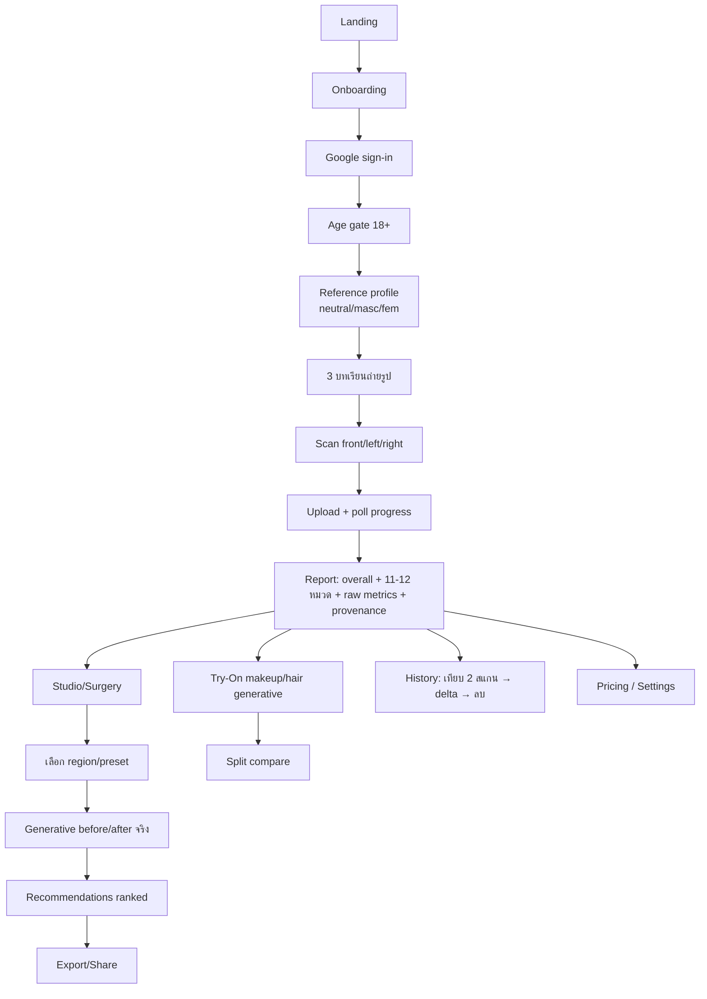

# DOODEE — Master Build Guide / คู่มือสร้างแอพใช้งานจริง

> เอกสารสองภาษา (ไทยนำ + ศัพท์เทคนิคอังกฤษ) สำหรับยกโปรเจกต์ `DoodeeMockup` ไปเป็นแอพ production ในโฟลเดอร์ใหม่ `~/Downloads/doodee2/doodee-app`
> Bilingual guide for turning the `DoodeeMockup` prototype into a real, shippable product.

**สถานะแหล่งข้อมูล / Source of truth:** โค้ดจริงใน `DoodeeMockup/` (backend ที่ทำงานได้ + web ที่ต่อ API บางส่วน) และ PRD 4 ไฟล์ (`requirements.md`, `action_plan.md`, `ai_developer_prompt.md`, `facial_analysis_plan.md`)

**Decisions ที่ล็อกแล้ว / Locked decisions:**
| หัวข้อ | เลือก |
|---|---|
| ขอบเขต / Scope | เว็บ + มือถือ (React Native / Expo) |
| Web stack | เก็บ Vite/React เดิม + `react-router-dom` |
| Try-On / จำลองศัลยกรรม | Generative AI จริง (cloud image-edit API) |
| ที่ตั้ง + Storage | sibling `doodee-app/` + Supabase Storage |
| ภาษาเอกสาร | สองภาษา |

---

## 0. ภาพรวมผลิตภัณฑ์ + Disclaimer / Product & Safety

**Doodee (ดูดี)** = แอพวิเคราะห์สัดส่วนใบหน้า + สุขภาพผิว แล้วสร้างรายงานเฉพาะบุคคล พร้อมคำแนะนำการดูแล/หัตถการ (non-surgical + surgical) และภาพจำลอง before/after
User ถ่ายรูปหน้า 3 มุม (front / left / right) → ระบบวัด ~122 metric เชิงเรขาคณิต (MediaPipe 478 landmarks + OpenCV) → ให้คะแนน 11–12 หมวด → แนะนำ + จำลองผล

**กลุ่มผู้ใช้ / Users:** ผู้สนใจความงาม, ผู้เตรียมปรึกษาคลินิก/แพทย์, คลินิกที่ใช้เป็นเครื่องมือ pre-consultation

### ⚠️ Disclaimer & ข้อบังคับ (ต้องแสดงในแอพจริง)
- ผลลัพธ์เป็น **"experimental measurement"** — **ไม่ใช่การวินิจฉัยทางการแพทย์** และไม่ใช่คะแนนความสวยที่ผ่านการรับรองทางคลินิก (คงจุดยืนเดิมจาก `README.md`)
- **Generative simulation = ภาพจำลอง** เท่านั้น ต้องมี watermark "SIMULATION" และห้ามการันตีผลหัตถการจริง
- **Adult-gate:** ต่อยอดฟิลด์ `is_adult` เดิม — ผู้เยาว์ (<18) เข้าโหมดจำกัด, **ห้ามแสดง/สร้างภาพจำลองศัลยกรรมสำหรับผู้เยาว์เด็ดขาด**
- **Consent + PDPA:** ภาพใบหน้าเป็นข้อมูลชีวมิติ (biometric) ต้องขอ consent ชัดเจน, กำหนด retention, ให้ผู้ใช้ลบได้จริง (มี `DELETE /scans/:id` อยู่แล้ว — ต้องลบทั้งใน Supabase + before/after ที่ generate)

---

## 1. สถาปัตยกรรมเป้าหมาย / Target Architecture (Monorepo)

```
doodee-app/
├─ apps/
│  ├─ web/            # Vite + React 19 (ยกจาก DoodeeMockup/src + react-router)
│  └─ mobile/         # Expo (React Native) — กล้องสแกน 3 มุม
├─ backend/           # FastAPI + Celery worker (ยกจาก DoodeeMockup/backend)
├─ packages/
│  └─ shared/         # api client, types, i18n strings, design tokens (ใช้ร่วม web+mobile)
├─ compose.yaml       # postgres + redis + api + worker
├─ .env.example
└─ package.json       # workspaces (npm/pnpm) จัดการ apps/* + packages/*
```

**Data flow — scan (มีอยู่จริงแล้ว / already working):**
```
client → POST /scan/upload (front,left,right,reference_profile,is_adult)
       → Supabase Storage (users/{uid}/scans/{token}/{view})
       → สร้าง Scan row (status=pending) → dispatch Celery
worker → download 3 รูป → MediaPipe FaceLandmarker → FEATURE_PAIRS + skin metrics
       → scoring (ideal/tolerance) → write analysis_data + scores (JSONB) → status=completed
client → poll GET /scan/status/{id} (ทุก 1.5s) → render report
```

**Data flow — simulation (ของใหม่ / new):**
```
client → POST /simulate (scan_id, region, preset/params)
       → Celery → สร้าง mask จาก landmarks → เรียก generative API (inpaint เฉพาะบริเวณ)
       → เก็บ before/after ใน Supabase → poll สถานะ → แสดง split-compare
```

---

## 2. Tech Stack (พร้อมเหตุผล / with rationale)

### Web (`apps/web`) — เก็บ Vite/React เดิม
| ของเดิม (คงไว้) | เพิ่มใหม่ | เหตุผล |
|---|---|---|
| React 19, Vite 8 | `react-router-dom` | เลิก routing แบบ `useState` ใน `App.jsx` → รองรับ deep-link, back button, share-report URL |
| Firebase JS SDK | `@tanstack/react-query` | จัดการ polling `waitForScan` + cache + retry แทนการเขียน poll เอง |
| lucide-react, html-to-image | `zod` | validate response/form ให้ตรง type |
| CSS 5 ไฟล์ (~12.5k บรรทัด) | i18n เบา ๆ (เช่น `react-i18next` หรือ context) | แทนการส่ง prop `lang` ด้วยมือทุก component |

### Mobile (`apps/mobile`) — ใหม่ทั้งหมด
- **Expo SDK** + `expo-camera` / `expo-image-picker` (กล้องในแอพสำหรับสแกน 3 มุม ตาม PRD Phase 5)
- `expo-router` (file-based routing), reuse `packages/shared` (api client + i18n + tokens)
- Build/ship ด้วย **EAS Build**

### Backend (`backend`) — คงสแตกเดิม + เสริมความพร้อม production
- คงเดิม: FastAPI, Celery + Redis, SQLAlchemy 2, MediaPipe 0.10.21 (**ผูก Python 3.11** เพราะ wheel), OpenCV, Firebase Admin, Pydantic 2
- **เพิ่ม:** **Alembic migrations** (แทน `Base.metadata.create_all` ที่ auto-create) · **rate limiting** (เช่น slowapi) · **secrets management** (ลบ `.env`/`.venv` ที่หลุดใน tree ออก) · error tracking (Sentry)

### DB / Storage / Auth
- **PostgreSQL** (JSONB สำหรับ `analysis_data`/`scores` — ห้ามแตกเป็น 100 คอลัมน์ ตามข้อห้ามใน PRD)
- **Supabase Storage** bucket `face-scans` (private, signed URL) — คงเดิม
- **Firebase Auth** (Google sign-in) — คงเดิม

### 🎨 Generative Simulation — คำแนะนำ (Recommendation)
> ตอนนี้ Try-On / Surgery เป็น **mock CSS ล้วน** ต้องทำเป็น generative จริง

**MVP: ใช้ cloud image-edit API (ไม่ self-host GPU ก่อน)** — เริ่มเร็ว จ่ายตามการใช้:
- ตัวเลือก: **Gemini image edit** (targeted edit สไตล์ Nano-Banana) หรือ **Flux Kontext / SDXL-inpaint ผ่าน Replicate**
- **สร้าง mask จาก MediaPipe landmarks** (จมูก/คาง/กราม/ริมฝีปาก/แก้ม) แล้ว inpaint **เฉพาะบริเวณ** → คุมไม่ให้ทั้งหน้าเปลี่ยน + รักษาอัตลักษณ์
- รันผ่าน **Celery async** (ตามข้อห้าม "ห้าม block FastAPI event loop")
- เก็บ before/after ใน Supabase, จ่าย signed URL, ใส่ **watermark "SIMULATION"**
- **Guardrails:** adult-gate (ต่อ `is_adult`), consent ชัดเจน, ไม่จำลองผู้เยาว์, prompt เชิงบวก/ปลอดภัย, กันคำขอที่ไม่เหมาะสม

**Phase หลัง (ถ้า volume/ต้นทุนคุ้ม):** self-host diffusion (ComfyUI / SDXL + ControlNet/inpaint) บน GPU เพื่อคุมต้นทุนต่อภาพและความเป็นส่วนตัว

**สิ่งที่ต้องกริลก่อนเริ่ม Phase นี้ (ดู `/grilling`):** ต้นทุน+latency ต่อการเรียก, การเก็บ/ลบภาพที่ generate, ความยินยอมและข้อความกำกับผล

---

## 3. UX / UI

### Design system (รวมจากของเดิม → `packages/shared/tokens`)
- **สี:** `--apple-blue #0066cc` (accent, alias `--brand-green`), ink `#1d1d1f`, muted `#6e6e73`, parchment `#f5f5f7`, hairline `#d2d2d7`
- **ฟอนต์:** SF Pro Display/Text + **Noto Sans Thai** (bilingual), serif สำหรับหัวข้ออังกฤษ, DooDee sans สำหรับไทย
- **สไตล์:** การ์ดขาว radius 24px, เส้น hairline, เงาบาง, glassmorphism (`liquid-glass.css`)
- **งานทำความสะอาด:** เลิก hardcode hex ใน JSX → อ้าง token กลาง; รวม CSS 5 ไฟล์ให้เป็นระบบเดียว

### หลัก UX ที่ต้องยึด (ผ่าน design-qa.md มาแล้ว)
- scan frame **4:5 + `object-fit: cover`** (แก้ปัญหา letterbox)
- **touch target 44px**, รองรับ **reduced-motion**
- **under-18 restricted mode**, ลำดับสแกน **Front → Left → Right**
- Lucide icons, CTA ภาษาไทย (เช่น "เริ่มสแกนใบหน้า")

### User flows (Mermaid)


### หน้าจอที่ต้องตัดสินใจ (จาก mockup)
- **ฟื้นหรือลบ orphan screens:** `ScanView.jsx` (1330 บรรทัด), `TreatmentFlowView`, `FaceScanReport`, `ConsultationReportView`, `CompareView`, `Navbar` — เป็น dead code วันนี้ แต่มี UI ที่ขุดมาใช้ได้ (เช่น "Report for Doctor" ใน `ConsultationReportView` เหมาะกับ use case คลินิก)
- แทน routing `useState` ใน `App.jsx` ด้วย router จริง

---

## 4. Backend: จาก mock → real (endpoint ที่ต้องสร้าง)

| ของ mock ปัจจุบัน | ทำเป็นจริง |
|---|---|
| `data/studio.js` presets + `rankStudioRecommendations()` (client-side) | `GET /studio/plan?scan_id=` — server ranking จาก `analysis_data` จริง |
| `buildDemoAnalysis()` (สร้างสถานะปลอม) | ใช้ `analysis_data` จริงของสแกน |
| `PRESET_MODELS` / `PROFILE_DEMO_ASSETS` / `SCAN_HISTORY` (mockData.js) | ผลสแกนจริงของผู้ใช้ (มี `GET /scans` แล้ว) |
| Try-On / Surgery mock CSS | `POST /simulate` (generative async) + `GET /simulate/status/:id` |
| `SettingsView` / `PricingView` (local state) | persistence + subscription table + billing (Stripe หรือ Omise สำหรับไทย) |
| share link `doodee.app/report?id=...` (hardcode) | `GET /report/:token` (public, revocable) |

**งานโครงสร้าง backend (จาก `action_plan.md` ที่ยังค้าง):**
- [ ] Alembic migrations (แทน `create_all`)
- [ ] วิจัย + seed **Golden Ratio / Marquardt Mask** จริง (action_plan 3.1 ยังเป็น placeholder `ideal`/`tolerance`)
- [ ] Accuracy test ด้วยรูปตัวอย่าง (action_plan 3.5)
- [ ] แยก ideal/recommendation ตาม profile จริง (neutral/masc/fem ตอนนี้ใช้ค่าเดียวกัน)
- [ ] rate limiting + Sentry
- [ ] **ลบ `.venv/` ออกจาก tree + audit `.env` ที่ commit หลุด** (ก่อนเปิด public)

---

## 5. กระบวนการทีละขั้นตอน / Step-by-step (Phased) + TODO

> **ก่อนเริ่มทุก Phase:** รัน `/grilling` เพื่อกริลการตัดสินใจให้คมก่อนเขียนโค้ด

### Phase 0 — Setup โครงสร้าง
- [ ] สร้าง monorepo `doodee-app/` (npm/pnpm workspaces: `apps/*`, `packages/*`)
- [ ] ย้าย `backend/` เข้า `doodee-app/backend` (คง flat structure หรือ refactor เป็น `app/` ตาม PRD — ตัดสินใจตอนกริล)
- [ ] ย้าย `src/` → `apps/web/` + คง CSS/assets
- [ ] ตั้ง `.env.example`, Supabase bucket `face-scans`, Firebase Google sign-in
- [ ] `docker compose up --build` ผ่าน (postgres+redis+api+worker)
- [ ] ติดตั้งสกิล `/grilling` (มีในเอกสารนี้แล้ว)

### Phase 1 — Web hardening
- [ ] เพิ่ม `react-router-dom` แทน `currentRoute` state
- [ ] เพิ่ม TanStack Query จัดการ polling/cache
- [ ] รวม design tokens → `packages/shared`, เลิก hardcode hex
- [ ] ตัดสินใจ orphan screens (ลบ/ฟื้น), ลบ mockData ที่ไม่ใช้
- [ ] ต่อ Studio กับผลสแกนจริง (เลิก `buildDemoAnalysis`)

### Phase 2 — Backend real data
- [ ] Alembic migrations
- [ ] `GET /studio/plan` (ย้าย ranking มาฝั่ง server)
- [ ] seed สัดส่วนจริง + accuracy test + แยก profile
- [ ] rate limit + secrets cleanup

### Phase 3 — Generative simulation (ของใหม่หลัก)
- [ ] `POST /simulate` + `GET /simulate/status/:id` + Celery task
- [ ] mask generator จาก MediaPipe landmarks (ต่อยอด `analysis.py`)
- [ ] เชื่อม cloud image-edit API (Gemini / Replicate)
- [ ] เก็บ before/after + signed URL + watermark
- [ ] guardrails: consent, adult-gate, ห้ามผู้เยาว์
- [ ] แทน Try-On / Surgery mock ด้วยผลจริง

### Phase 4 — Mobile (Expo)
- [ ] scaffold `apps/mobile` (Expo + expo-router)
- [ ] กล้องในแอพ สแกน 3 มุม (`expo-camera`)
- [ ] reuse `packages/shared` (api + i18n + tokens)
- [ ] onboarding + report + history บนมือถือ

### Phase 5 — Billing + share + settings
- [ ] subscription table + Stripe/Omise
- [ ] `GET /report/:token` share link (revocable)
- [ ] persist settings/face-profile จริง

### Phase 6 — Deploy
- [ ] web → Vercel หรือ Cloudflare Pages (มี `vercel.json` + Workers shim เดิมเป็น hint)
- [ ] backend + worker → container (Fly/Render/Cloud Run) + managed Postgres + Redis
- [ ] mobile → EAS Build → TestFlight / Play Console
- [ ] monitoring + log + alert

---

## 6. Verification / วิธีตรวจว่าทำงานจริง

**Web:**
```bash
npm run lint      # oxlint
npm run build
node --test src/data/studio.test.js
```
**Backend:**
```bash
python3 -m unittest backend.test_analysis backend.test_storage
```
**E2E (ตาม README):**
```bash
docker compose up --build   # api :8001/docs, worker, postgres, redis
npm run dev                 # web :5173
```
ทดสอบ flow เต็ม: sign-in → upload 3 รูป → เห็น report (overall + หมวด) → `POST /simulate` → เห็น before/after → เทียบใน History → ลบได้จริง (ตรวจว่าลบใน Supabase ด้วย)

---

## ภาคผนวก: คำสั่ง scaffold โฟลเดอร์ใหม่ (ทำเป็นขั้นถัดไป — ยืนยันก่อน)
```bash
# จาก ~/Downloads/doodee2
mkdir -p doodee-app/apps doodee-app/packages/shared
cp -R DoodeeMockup/backend doodee-app/backend
rsync -a --exclude node_modules --exclude dist DoodeeMockup/src DoodeeMockup/public DoodeeMockup/index.html DoodeeMockup/vite.config.js doodee-app/apps/web/
cp DoodeeMockup/compose.yaml DoodeeMockup/.env.example doodee-app/
# จากนั้น: ตั้ง workspaces ใน package.json ราก, เพิ่ม react-router, เริ่ม Phase 1
```
> ⚠️ **ไม่** คัดลอก `.env` จริง / `.venv/` ไปโฟลเดอร์ใหม่ — ตั้งค่าใหม่จาก `.env.example`
